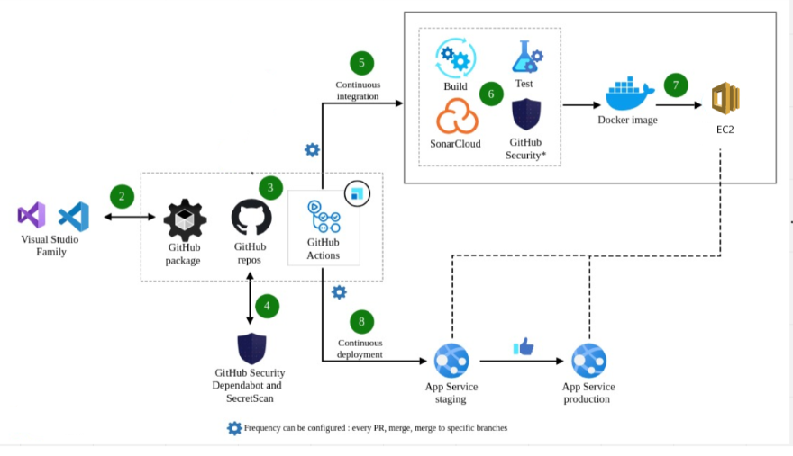
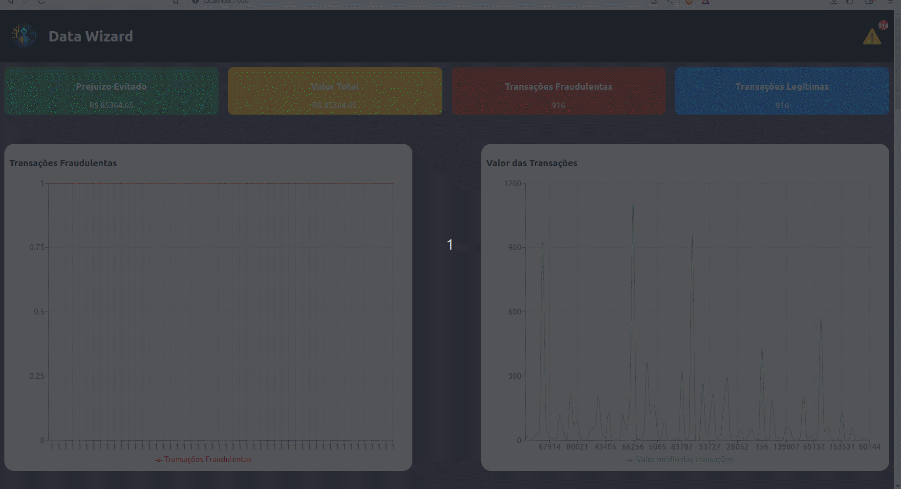

<div style="display: flex; align-items: center;">
  
  <h1>Data Wizard - Front-end</h1>
</div>

<p align="center">
  
  
  
  
  
  
   
</p>


### Tópicos 

:small_blue_diamond: [Descrição do projeto](#descrição-do-projeto)

:small_blue_diamond: [Funcionalidades](#funcionalidades)

:small_blue_diamond: [Deploy da Aplicação](#deploy-da-aplicação-dash)

:small_blue_diamond: [Pré-requisitos](#pré-requisitos)

:small_blue_diamond: [Como rodar a aplicação](#como-rodar-a-aplicação-arrow_forward)

## Descrição do projeto 

<p align="justify">
  O projeto visa detecção de fraudes e tem como objetivo identificar atividades ou padrões não usuais (incomuns). Como por exemplo, falsificação de assinaturas em cheques, clonagem de cartões de crédito, lavagem de dinheiro, declarar falência propositalmente (bankruptcy), etc.
</p>

<p align="justify">
  Esta aplicação front-end é a interface do projeto de detecção de fraudes, fornecendo uma experiência amigável para os usuários visualizarem e interagirem com os resultados. Ela exibe gráficos e permite a visualização de parâmetros em diferentes aspectos, ajudando na identificação de atividades suspeitas. Também oferece notificações em tempo real para reações rápidas e seguras, podendo através delas fazer o julgamento.
</p>

## Funcionalidades

:heavy_check_mark: Visualizacao gráfica das transações em tempo real

:heavy_check_mark: Contagem de prejuízo evitado  

:heavy_check_mark: Possibila o operador anotar novos dados para treinos futuros da inteligência artificial  

:heavy_check_mark: Visualização gráfica e personalizada pelo usuário de qualquer um dos atributos das transações com diferentes métodos de visualização de dados (pontos, histograma, etc) 

## Layout ou Deploy da Aplicação :dash:




## Pré-requisitos

:warning: [Docker](https://docs.docker.com/engine/install/ubuntu/)

## Como rodar a aplicação :arrow_forward:

##### No terminal, clone o projeto: 

```
git clone git@github.com:enzodpaiva/Deteccao-Fraude-pantanal.dev-Frontend.git
```
##### Criar .env na raiz do projeto a partir do .env.example
```bash 
cp .env.example .env
```

##### Adicionar chave da API no .env em REACT_APP_API_TOKEN

##### Executar aplicação através do Docker

```bash 
docker-compose up -d --build
```
##### Derrubar aplicação através do Docker

```bash 
docker-compose down
``` 

## Casos de Uso
- visualização dos dados
- check fraude ou não
- visualização avançada dos dados


 

## Linguagens, dependencias e libs utilizadas :books:

- [React](https://pt-br.reactjs.org/docs/create-a-new-react-app.html)
- [Docker](https://docs.docker.com/)
- [ES12](https://developer.mozilla.org/en-US/docs/Web/JavaScript)

## Futuras melhorias que almejamos implementar

Se for o caso, liste tarefas/funcionalidades que ainda precisam ser implementadas na sua aplicação

:memo: Permitir visualizar relatorio das fraudes computadas.

:memo: Possibilidade de pesquisar fraudes que ocorreram no passado.

:memo: Implementar autenticação e controle de acesso para garantir a segurança dos usuários. 

:memo: Adicionar suporte a diferentes tipos de fontes de dados para a detecção de fraudes, como feeds de redes sociais, dados de transações financeiras adicionais, etc.

:memo: Melhorar a interface do usuário para tornar a navegação mais intuitiva e amigável.

:memo: Integrar a aplicação com serviços de notificação por e-mail ou mensagens para alertar os usuários sobre atividades suspeitas.

:memo: Implementar um sistema de feedback dos usuários para coletar sugestões e melhorar continuamente a aplicação.

:memo: Realizar testes rigorosos de desempenho para garantir que a aplicação possa lidar com grandes volumes de dados de forma eficiente.

:memo: Integrar a aplicação com sistemas de terceiros, como bancos de dados, para obter informações adicionais para análise de fraudes.

## Desenvolvedores

| [<br><sub>Enzo Paiva</sub>](https://github.com/enzodpaiva) |  [<br><sub>Alexandre Shimizu</sub>](https://github.com/AlexandreSh) |  [<br><sub>Eduardo Lopes</sub>](https://github.com/edu010101) | [<br><sub>Vitor Yuske</sub>](https://github.com/TuskNinja) |
| :---: | :---: | :---: | :---: |


## Licença 

The [MIT License]() (MIT)

Copyright :copyright: 2023 - Data Wizard - Front-end